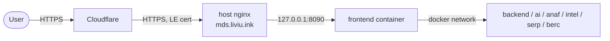

# Deployment & Operations

## Live environment

- **URL:** https://mds.liviu.ink
- **Host:** VPS (Ubuntu 24.04), Docker + docker compose
- **Edge:** Cloudflare (proxied) → host nginx (TLS via Let's Encrypt) → finalytics
  frontend container (`127.0.0.1:8090`) → microservices on the internal Docker network.



Only ports 22, 80 and 443 are public. Every finalytics service except the
frontend binds to `127.0.0.1` (via `BIND=127.0.0.1:` in the server `.env`),
so the microservices are not directly reachable from the internet.

## Seeded accounts (user types)

The backend seeds two accounts on first start. There are **two roles**: `admin`
and `user`.

| Username | Password | Role | Tokens |
|----------|----------|------|--------|
| `admin`  | `admin123` | admin | 9999 |
| `demo`   | `demo123`  | user  | 50 |

New self-registered accounts get the `user` role and 10 starter tokens.
**Change these defaults for any real use** (`POST /auth/register` an admin, then
remove the seeds, or rotate passwords).

- **admin**: full access — `/admin/users`, `/admin/grant-tokens`, `/admin/logs`,
  `/admin/token-costs`, plus everything a user can do.
- **user**: search, analyze, score, AI agents, Q&A, compare, feedback, alerts,
  history and export — gated by the token balance.

## CI/CD (deterministic)

1. Push to `main` → **Finalytics CI** (`.github/workflows/ci.yml`): pytest matrix
   (ai_module + backend), ruff lint, and Docker builds for the light images.
2. On CI success → **Deploy to VPS** (`.github/workflows/deploy.yml`): SSH to the
   VPS, `git reset --hard origin/main`, `docker compose up -d --build`, prune.
3. A **health gate** then polls the stack and fails the deploy unless the
   frontend returns 200 and ≥6 services are healthy.

Determinism: every module pins exact dependency versions (including the
Playwright/Chromium version), the deploy checks out an exact commit, and CI
actions are version-pinned. Tests are hermetic (LLM/network calls are mocked or
use the deterministic fallback), so runs are reproducible.

Required GitHub secrets: `VPS_HOST`, `VPS_USER`, `VPS_SSH_KEY`.

## Operating the server

```bash
cd /opt/finalytics
docker compose ps                 # health of all services
docker compose logs -f ai-api     # tail a service
docker compose up -d --build      # manual redeploy
```

Secrets live in `/opt/finalytics/.env` (git-ignored, chmod 600). After rotating
a key, update that file and run `docker compose up -d <service>`.
