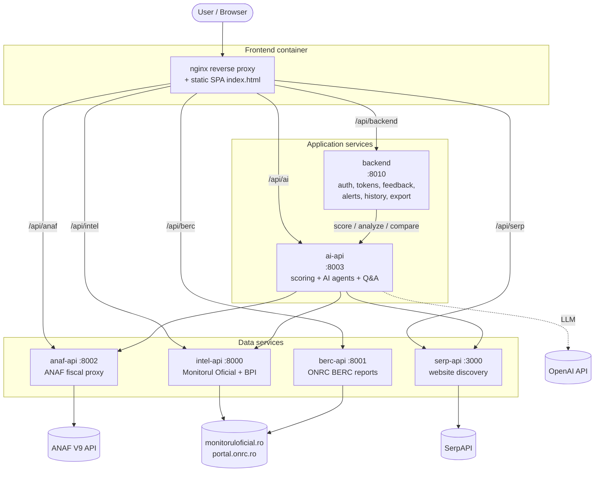
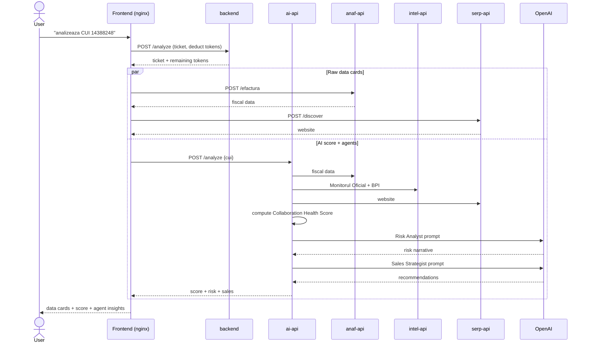
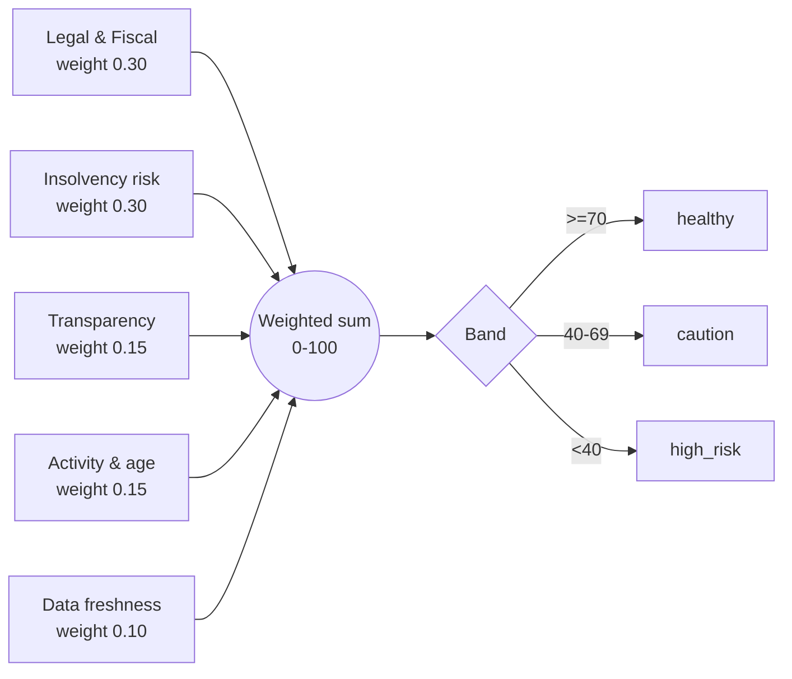
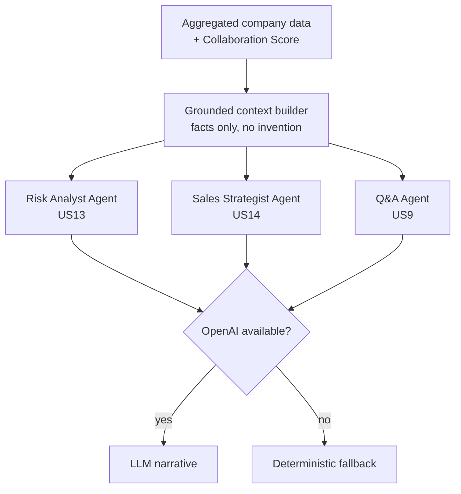
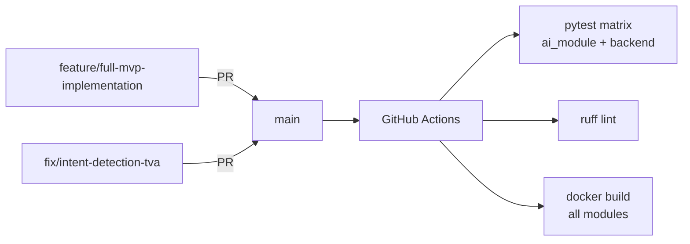

# Finalytics — Architecture & Diagrams

This document describes the **as-built** architecture of the Finalytics MVP.
All diagrams are written in Mermaid and render directly on GitHub.

## 1. Component / Container diagram

Finalytics is a set of FastAPI microservices behind an nginx reverse proxy,
plus a static single-page UI. Each module ships as its own Docker image and is
orchestrated by `docker-compose.yml`.

## 2. Analysis sequence (happy path)

How a single "analyze this company" request flows through the system.

## 3. Scoring model

The Collaboration Health Score (0–100) is a deterministic weighted sum of five
pillars. Each pillar produces a 0–100 sub-score and a list of human-readable
reasons (explainability).

## 4. AI agents

The fallback path guarantees the agents always return a sensible, grounded
answer even with no API key or during an outage — and it is what the automated
agent evals exercise in CI.

## 5. Git / CI workflow

